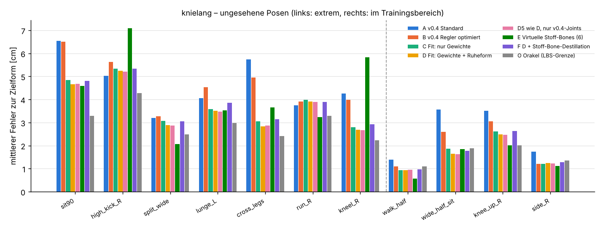
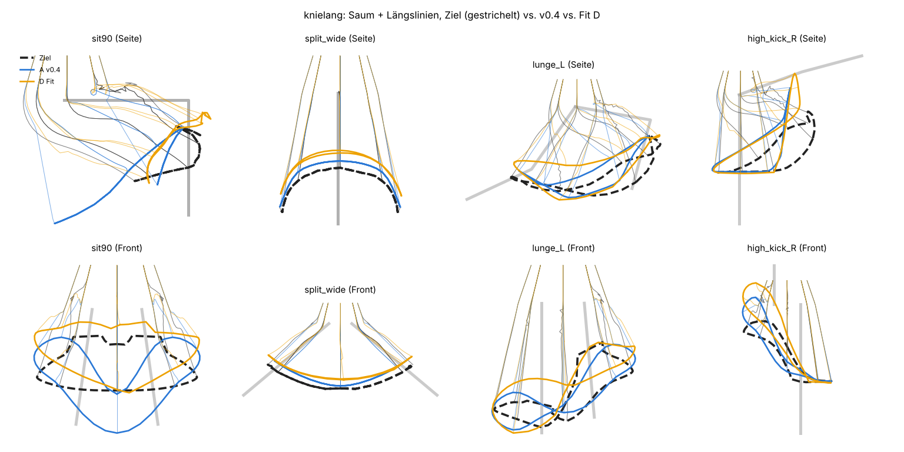
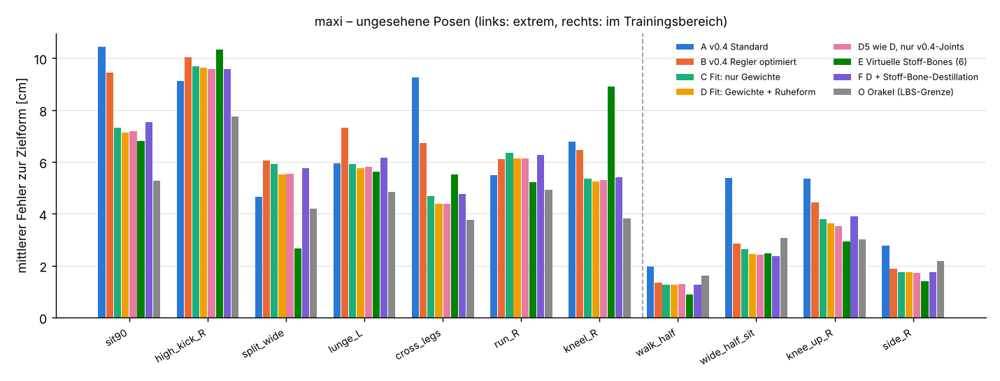
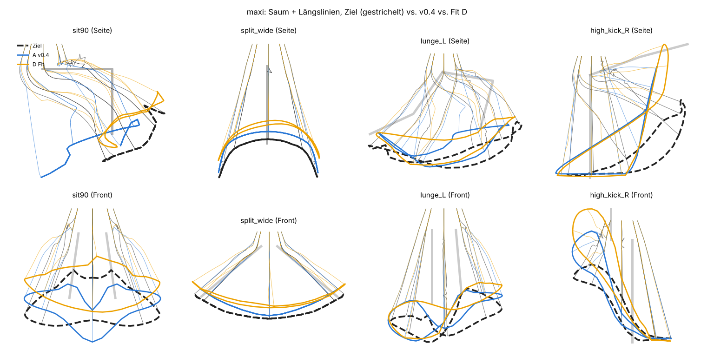

# Ergebnisse: Posen-Fit vs. v0.4 (automatisch erzeugt)

Erzeugt von `experiments/sl_dress_study.py`. Fehler in cm, SL-Maßstab (Meter).
Zielformen sind ein **skriptbasierter Proxy** für manuell korrigierte Posen, keine echten Sculpts.

## Kleid „knielang“ (1632 Vertices, 28 s)

### Trainingsposen (zur Optimierung benutzt)

| Methode | Ø Fehler cm | p95 cm | Max cm | Durchdringung % Vtx | max. Eindringtiefe cm | Dehnung p95 % | Bindepose-Abw. max cm |
|---|---:|---:|---:|---:|---:|---:|---:|
| A v0.4 Standard | 2.87 | 8.75 | 28.06 | 2.6 | 6.32 | 35.1 | 0.00 |
| B v0.4 Regler optimiert | 2.33 | 5.54 | 12.44 | 0.7 | 5.06 | 42.0 | 0.00 |
| C Fit: nur Gewichte | 1.70 | 4.04 | 7.76 | 0.4 | 3.86 | 40.9 | 0.00 |
| D Fit: Gewichte + Ruheform | 1.57 | 3.74 | 7.37 | 0.4 | 3.84 | 40.1 | 1.22 |
| D5 wie D, nur v0.4-Joints | 1.57 | 3.73 | 7.37 | 0.5 | 3.72 | 37.8 | 1.24 |
| E Virtuelle Stoff-Bones (6) | 0.76 | 1.78 | 5.09 | 0.5 | 3.53 | 37.8 | 0.00 |
| F D + Stoff-Bone-Destillation | 1.75 | 4.25 | 7.69 | 0.5 | 3.82 | 39.2 | 0.90 |
| O Orakel (LBS-Grenze) | 1.71 | 4.10 | 8.89 | 0.5 | 4.86 | 36.7 | 2.31 |

### Ungesehene Posen im Trainingsbereich

| Methode | Ø Fehler cm | p95 cm | Max cm | Durchdringung % Vtx | max. Eindringtiefe cm | Dehnung p95 % | Bindepose-Abw. max cm |
|---|---:|---:|---:|---:|---:|---:|---:|
| A v0.4 Standard | 2.55 | 8.43 | 20.28 | 1.0 | 6.32 | 29.0 | 0.00 |
| B v0.4 Regler optimiert | 1.99 | 5.20 | 11.88 | 1.1 | 5.06 | 35.4 | 0.00 |
| C Fit: nur Gewichte | 1.66 | 4.16 | 10.63 | 1.2 | 4.62 | 33.8 | 0.00 |
| D Fit: Gewichte + Ruheform | 1.58 | 3.96 | 10.17 | 1.3 | 4.74 | 32.8 | 1.22 |
| D5 wie D, nur v0.4-Joints | 1.57 | 3.95 | 10.06 | 1.2 | 4.74 | 30.4 | 1.24 |
| E Virtuelle Stoff-Bones (6) | 1.39 | 3.36 | 8.15 | 1.2 | 5.02 | 30.0 | 0.00 |
| F D + Stoff-Bone-Destillation | 1.67 | 4.16 | 10.74 | 1.2 | 4.70 | 31.8 | 0.90 |
| O Orakel (LBS-Grenze) | 1.58 | 4.21 | 10.00 | 0.9 | 5.01 | 29.3 | 2.31 |

### Ungesehene Extremposen

| Methode | Ø Fehler cm | p95 cm | Max cm | Durchdringung % Vtx | max. Eindringtiefe cm | Dehnung p95 % | Bindepose-Abw. max cm |
|---|---:|---:|---:|---:|---:|---:|---:|
| A v0.4 Standard | 4.65 | 13.61 | 32.87 | 7.0 | 6.32 | 58.5 | 0.00 |
| B v0.4 Regler optimiert | 4.68 | 11.93 | 29.71 | 6.6 | 6.52 | 65.2 | 0.00 |
| C Fit: nur Gewichte | 3.81 | 10.37 | 27.68 | 7.1 | 6.89 | 69.2 | 0.00 |
| D Fit: Gewichte + Ruheform | 3.68 | 10.09 | 27.71 | 7.2 | 6.68 | 67.9 | 1.22 |
| D5 wie D, nur v0.4-Joints | 3.67 | 10.09 | 27.20 | 7.2 | 6.85 | 64.7 | 1.24 |
| E Virtuelle Stoff-Bones (6) | 4.28 | 11.35 | 24.10 | 6.9 | 7.01 | 72.0 | 0.00 |
| F D + Stoff-Bone-Destillation | 3.86 | 10.46 | 27.22 | 7.0 | 6.76 | 66.6 | 0.90 |
| O Orakel (LBS-Grenze) | 3.00 | 8.16 | 21.62 | 6.7 | 7.12 | 63.7 | 2.31 |

### Extremposen einzeln (Ø Fehler cm)

| Pose | A | B | C | D | D5 | E | F | O |
|---|---:|---:|---:|---:|---:|---:|---:|---:|
| sit90 | 6.54 | 6.50 | 4.85 | 4.67 | 4.68 | 4.59 | 4.80 | 3.29 |
| high_kick_R | 5.03 | 5.62 | 5.34 | 5.25 | 5.21 | 7.09 | 5.35 | 4.28 |
| split_wide | 3.20 | 3.28 | 3.07 | 2.88 | 2.87 | 2.07 | 3.05 | 2.49 |
| lunge_L | 4.05 | 4.53 | 3.59 | 3.51 | 3.47 | 3.52 | 3.86 | 2.99 |
| cross_legs | 5.74 | 4.96 | 3.04 | 2.84 | 2.87 | 3.66 | 3.15 | 2.42 |
| run_R | 3.75 | 3.91 | 3.99 | 3.92 | 3.89 | 3.24 | 3.89 | 3.29 |
| kneel_R | 4.26 | 3.98 | 2.79 | 2.69 | 2.68 | 5.83 | 2.93 | 2.23 |

B-Reglerwerte: `{'leg_follow': 0.9, 'center_hold': 0.35, 'knee_follow': 0.85, 'center_width': 2.5}`; Ruheform-Offset D: max 1.22 cm, Ø 0.35 cm.

## Kleid „maxi“ (1632 Vertices, 29 s)

### Trainingsposen (zur Optimierung benutzt)

| Methode | Ø Fehler cm | p95 cm | Max cm | Durchdringung % Vtx | max. Eindringtiefe cm | Dehnung p95 % | Bindepose-Abw. max cm |
|---|---:|---:|---:|---:|---:|---:|---:|
| A v0.4 Standard | 4.32 | 11.49 | 39.46 | 1.5 | 6.67 | 44.9 | 0.00 |
| B v0.4 Regler optimiert | 3.22 | 7.33 | 17.44 | 0.5 | 4.44 | 54.1 | 0.00 |
| C Fit: nur Gewichte | 2.42 | 6.06 | 13.92 | 0.3 | 4.21 | 51.4 | 0.00 |
| D Fit: Gewichte + Ruheform | 2.13 | 5.21 | 12.15 | 0.3 | 4.06 | 49.3 | 2.34 |
| D5 wie D, nur v0.4-Joints | 2.11 | 5.14 | 12.13 | 0.3 | 4.06 | 47.6 | 2.35 |
| E Virtuelle Stoff-Bones (6) | 0.95 | 2.10 | 4.50 | 0.4 | 2.81 | 47.4 | 0.00 |
| F D + Stoff-Bone-Destillation | 2.41 | 6.00 | 13.08 | 0.3 | 4.31 | 48.1 | 1.23 |
| O Orakel (LBS-Grenze) | 2.57 | 5.92 | 11.68 | 0.3 | 4.02 | 46.8 | 3.00 |

### Ungesehene Posen im Trainingsbereich

| Methode | Ø Fehler cm | p95 cm | Max cm | Durchdringung % Vtx | max. Eindringtiefe cm | Dehnung p95 % | Bindepose-Abw. max cm |
|---|---:|---:|---:|---:|---:|---:|---:|
| A v0.4 Standard | 3.87 | 10.74 | 21.96 | 0.8 | 6.67 | 35.2 | 0.00 |
| B v0.4 Regler optimiert | 2.63 | 6.50 | 17.44 | 0.6 | 4.44 | 44.5 | 0.00 |
| C Fit: nur Gewichte | 2.37 | 5.70 | 17.19 | 0.7 | 4.43 | 43.0 | 0.00 |
| D Fit: Gewichte + Ruheform | 2.27 | 5.46 | 15.85 | 0.7 | 4.31 | 41.0 | 2.34 |
| D5 wie D, nur v0.4-Joints | 2.24 | 5.47 | 14.51 | 0.7 | 4.31 | 38.6 | 2.35 |
| E Virtuelle Stoff-Bones (6) | 1.93 | 4.29 | 9.32 | 0.6 | 5.38 | 36.0 | 0.00 |
| F D + Stoff-Bone-Destillation | 2.32 | 5.53 | 16.38 | 0.7 | 4.50 | 38.8 | 1.23 |
| O Orakel (LBS-Grenze) | 2.47 | 6.27 | 13.04 | 0.6 | 4.44 | 36.3 | 3.00 |

### Ungesehene Extremposen

| Methode | Ø Fehler cm | p95 cm | Max cm | Durchdringung % Vtx | max. Eindringtiefe cm | Dehnung p95 % | Bindepose-Abw. max cm |
|---|---:|---:|---:|---:|---:|---:|---:|
| A v0.4 Standard | 7.39 | 19.19 | 49.09 | 4.7 | 6.67 | 78.7 | 0.00 |
| B v0.4 Regler optimiert | 7.45 | 18.86 | 51.08 | 4.1 | 6.95 | 88.1 | 0.00 |
| C Fit: nur Gewichte | 6.47 | 18.29 | 50.06 | 4.5 | 6.89 | 87.6 | 0.00 |
| D Fit: Gewichte + Ruheform | 6.26 | 17.80 | 50.44 | 4.7 | 6.94 | 84.5 | 2.34 |
| D5 wie D, nur v0.4-Joints | 6.28 | 17.95 | 52.22 | 4.7 | 6.93 | 81.3 | 2.35 |
| E Virtuelle Stoff-Bones (6) | 6.44 | 16.32 | 30.58 | 3.4 | 6.91 | 90.4 | 0.00 |
| F D + Stoff-Bone-Destillation | 6.50 | 18.17 | 49.03 | 4.4 | 6.95 | 81.3 | 1.23 |
| O Orakel (LBS-Grenze) | 4.95 | 13.87 | 35.07 | 4.2 | 6.96 | 79.7 | 3.00 |

### Extremposen einzeln (Ø Fehler cm)

| Pose | A | B | C | D | D5 | E | F | O |
|---|---:|---:|---:|---:|---:|---:|---:|---:|
| sit90 | 10.44 | 9.44 | 7.33 | 7.13 | 7.19 | 6.82 | 7.53 | 5.27 |
| high_kick_R | 9.12 | 10.03 | 9.70 | 9.63 | 9.58 | 10.33 | 9.57 | 7.75 |
| split_wide | 4.66 | 6.04 | 5.93 | 5.53 | 5.53 | 2.68 | 5.77 | 4.20 |
| lunge_L | 5.95 | 7.31 | 5.93 | 5.75 | 5.81 | 5.62 | 6.18 | 4.86 |
| cross_legs | 9.26 | 6.72 | 4.68 | 4.38 | 4.38 | 5.53 | 4.76 | 3.77 |
| run_R | 5.50 | 6.11 | 6.36 | 6.14 | 6.14 | 5.23 | 6.28 | 4.94 |
| kneel_R | 6.78 | 6.46 | 5.36 | 5.24 | 5.30 | 8.90 | 5.42 | 3.83 |

B-Reglerwerte: `{'leg_follow': 0.9, 'center_hold': 0.35, 'knee_follow': 0.5, 'center_width': 2.5}`; Ruheform-Offset D: max 2.34 cm, Ø 0.63 cm.
